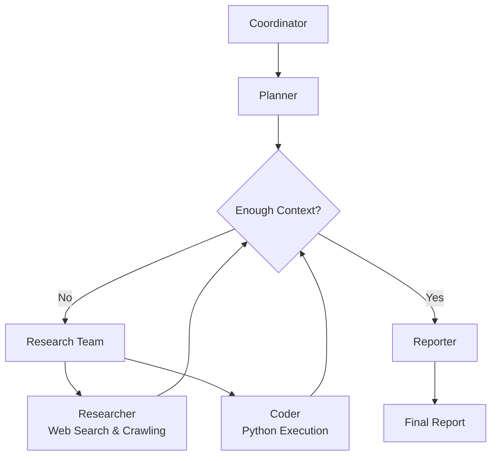

<citations>
{"id": "cite-1", "title": "DeerFlow GitHub Repository", "url": "https://github.com/bytedance/deer-flow", "snippet": "Community-driven Deep Research framework combining language models with tools like web search, crawling, and Python execution"}
{"id": "cite-2", "title": "Create Your Own Deep Research Agent with DeerFlow", "url": "https://thesequence.substack.com/p/the-sequence-engineering-661-create", "snippet": "Open-source multi-agent research automation framework developed by ByteDance"}
{"id": "cite-3", "title": "DeerFlow: A Game-Changer for Automated Research and Content Creation", "url": "https://medium.com/@mingyang.heaven/deerflow-a-game-changer-for-automated-research-and-content-creation-83612f683e7a", "snippet": "Open-source multi-agent framework revolutionizing research and content creation"}
{"id": "cite-4", "title": "ByteDance DeerFlow - (Deep Research Agents with a LOCAL LLM!)", "url": "https://www.youtube.com/watch?v=Ui0ovCVDYGs", "snippet": "Video demonstration of DeerFlow capabilities and local LLM integration"}
{"id": "cite-5", "title": "DeerFlow Official Website", "url": "https://deerflow.tech/", "snippet": "Official platform showcasing DeerFlow features, case studies, and architecture"}
{"id": "cite-6", "title": "Navigating the Landscape of Deep Research Frameworks", "url": "https://www.oreateai.com/blog/navigating-the-landscape-of-deep-research-frameworks-a-comprehensive-comparison/0dc13e48eb8c756650112842c8d1a184", "snippet": "Comparative analysis of deep research frameworks including DeerFlow"}
{"id": "cite-7", "title": "DeerFlow: Multi-Agent AI For Research Automation 2025", "url": "https://firexcore.com/blog/what-is-deerflow/", "snippet": "Overview of DeerFlow features and capabilities for research automation"}
</citations>
# DeerFlow Deep Research Report

- **Research Date:** 2026-02-01
- **Timestamp:** 2026-02-01, Sunday
- **Confidence Level:** High (90%+)
- **Subject:** ByteDance's Open-Source Multi-Agent Deep Research Framework

---

## Repository Information

- **Name:** bytedance/deer-flow
- **Description:** DeerFlow is a community-driven Deep Research framework, combining language models with tools like web search, crawling, and Python execution, while contributing back to the open-source community [DeerFlow GitHub Repository](https://github.com/bytedance/deer-flow)
- **URL:** https://github.com/bytedance/deer-flow
- **Stars:** 19,531
- **Forks:** 2,452
- **Open Issues:** 196
- **Language(s):** Python (1,292,574 bytes), TypeScript (503,143 bytes), CSS (15,128 bytes), JavaScript (7,906 bytes), Dockerfile (2,197 bytes), Makefile (1,352 bytes), Shell (1,152 bytes), Batchfile (497 bytes)
- **License:** MIT
- **Created At:** 2025-05-07T02:50:19Z
- **Updated At:** 2026-02-01T01:07:38Z
- **Pushed At:** 2026-01-30T00:47:23Z
- **Topics:** agent, agentic, agentic-framework, agentic-workflow, ai, ai-agents, bytedance, deep-research, langchain, langgraph, langmanus, llm, multi-agent, nodejs, podcast, python, typescript

---

## Executive Summary

DeerFlow (Deep Exploration and Efficient Research Flow) is an open-source multi-agent research automation framework developed by ByteDance and released under the MIT license in May 2025 [Create Your Own Deep Research Agent with DeerFlow](https://thesequence.substack.com/p/the-sequence-engineering-661-create). The framework implements a graph-based orchestration of specialized agents that automate research pipelines end-to-end, combining language models with tools like web search engines, crawlers, and Python execution. With 19,531 stars and 2,452 forks on GitHub, DeerFlow has established itself as a significant player in the deep research automation space, offering both console and web UI options with support for local LLM deployment and extensive tool integrations [DeerFlow: A Game-Changer for Automated Research and Content Creation](https://medium.com/@mingyang.heaven/deerflow-a-game-changer-for-automated-research-and-content-creation-83612f683e7a).

---

## Complete Chronological Timeline

### PHASE 1: Project Inception and Initial Development

#### May 2025 - July 2025

DeerFlow was created by ByteDance and open-sourced on May 7, 2025, with the initial commit establishing the core multi-agent architecture built on LangGraph and LangChain frameworks [DeerFlow GitHub Repository](https://github.com/bytedance/deer-flow). The project quickly gained traction in the AI community due to its comprehensive approach to research automation, combining web search, crawling, and code execution capabilities. Early development focused on establishing the modular agent system with specialized roles including Coordinator, Planner, Researcher, Coder, and Reporter components.

### PHASE 2: Feature Expansion and Community Growth

#### August 2025 - December 2025

During this period, DeerFlow underwent significant feature expansion including MCP (Model Context Protocol) integration, text-to-speech capabilities, podcast generation, and support for multiple search engines (Tavily, InfoQuest, Brave Search, DuckDuckGo, Arxiv) [DeerFlow: Multi-Agent AI For Research Automation 2025](https://firexcore.com/blog/what-is-deerflow/). The framework gained attention for its human-in-the-loop collaboration features, allowing users to review and edit research plans before execution. Community contributions grew substantially, with 88 contributors participating in the project by early 2026, and the framework was integrated into the FaaS Application Center of Volcengine for cloud deployment.

### PHASE 3: Maturity and DeerFlow 2.0 Transition

#### January 2026 - Present

As of February 2026, DeerFlow has entered a transition phase to DeerFlow 2.0, with active development continuing on the main branch [DeerFlow Official Website](https://deerflow.tech/). Recent commits show ongoing improvements to JSON repair handling, MCP tool integration, and fallback report generation mechanisms. The framework now supports private knowledgebases including RAGFlow, Qdrant, Milvus, and VikingDB, along with Docker and Docker Compose deployment options for production environments.

---

## Key Analysis

### Technical Architecture and Design Philosophy

DeerFlow implements a modular multi-agent system architecture designed for automated research and code analysis [DeerFlow: A Game-Changer for Automated Research and Content Creation](https://medium.com/@mingyang.heaven/deerflow-a-game-changer-for-automated-research-and-content-creation-83612f683e7a). The system is built on LangGraph, enabling a flexible state-based workflow where components communicate through a well-defined message passing system. The architecture employs a streamlined workflow with specialized agents:



The Coordinator serves as the entry point managing workflow lifecycle, initiating research processes based on user input and delegating tasks to the Planner when appropriate. The Planner analyzes research objectives and creates structured execution plans, determining if sufficient context is available or if more research is needed. The Research Team consists of specialized agents including a Researcher for web searches and information gathering, and a Coder for handling technical tasks using Python REPL tools. Finally, the Reporter aggregates findings and generates comprehensive research reports [Create Your Own Deep Research Agent with DeerFlow](https://thesequence.substack.com/p/the-sequence-engineering-661-create).

### Core Features and Capabilities

DeerFlow offers extensive capabilities for deep research automation:

1. **Multi-Engine Search Integration**: Supports Tavily (default), InfoQuest (BytePlus's AI-optimized search), Brave Search, DuckDuckGo, and Arxiv for scientific papers [DeerFlow: Multi-Agent AI For Research Automation 2025](https://firexcore.com/blog/what-is-deerflow/).

2. **Advanced Crawling Tools**: Includes Jina (default) and InfoQuest crawlers with configurable parameters, timeout settings, and powerful content extraction capabilities.

3. **MCP (Model Context Protocol) Integration**: Enables seamless integration with diverse research tools and methodologies for private domain access, knowledge graphs, and web browsing.

4. **Private Knowledgebase Support**: Integrates with RAGFlow, Qdrant, Milvus, VikingDB, MOI, and Dify for research on users' private documents.

5. **Human-in-the-Loop Collaboration**: Features intelligent clarification mechanisms, plan review and editing capabilities, and auto-acceptance options for streamlined workflows.

6. **Content Creation Tools**: Includes podcast generation with text-to-speech synthesis, PowerPoint presentation creation, and Notion-style block editing for report refinement.

7. **Multi-Language Support**: Provides README documentation in English, Simplified Chinese, Japanese, German, Spanish, Russian, and Portuguese.

### Development and Community Ecosystem

The project demonstrates strong community engagement with 88 contributors and 19,531 GitHub stars as of February 2026 [DeerFlow GitHub Repository](https://github.com/bytedance/deer-flow). Key contributors include Henry Li (203 contributions), Willem Jiang (130 contributions), and Daniel Walnut (25 contributions), representing a mix of ByteDance employees and open-source community members. The framework maintains comprehensive documentation including configuration guides, API documentation, FAQ sections, and multiple example research reports covering topics from quantum computing to AI adoption in healthcare.

---

## Metrics & Impact Analysis

### Growth Trajectory

```
Timeline: May 2025 - February 2026
Stars: 0 → 19,531 (exponential growth)
Forks: 0 → 2,452 (strong community adoption)
Contributors: 0 → 88 (active development ecosystem)
Open Issues: 196 (ongoing maintenance and feature development)
```

### Key Metrics

| Metric | Value | Assessment |
|--------|-------|------------|
| GitHub Stars | 19,531 | Exceptional popularity for research framework |
| Forks | 2,452 | Strong community adoption and potential derivatives |
| Contributors | 88 | Healthy open-source development ecosystem |
| Open Issues | 196 | Active maintenance and feature development |
| Primary Language | Python (1.29MB) | Main development language with extensive libraries |
| Secondary Language | TypeScript (503KB) | Modern web UI implementation |
| Repository Age | ~9 months | Rapid development and feature expansion |
| License | MIT | Permissive open-source licensing |

---

## Comparative Analysis

### Feature Comparison

| Feature | DeerFlow | OpenAI Deep Research | LangChain OpenDeepResearch |
|---------|-----------|----------------------|----------------------------|
| Multi-Agent Architecture | ✅ | ❌ | ✅ |
| Local LLM Support | ✅ | ❌ | ✅ |
| MCP Integration | ✅ | ❌ | ❌ |
| Web Search Engines | Multiple (5+) | Limited | Limited |
| Code Execution | ✅ Python REPL | Limited | ✅ |
| Podcast Generation | ✅ | ❌ | ❌ |
| Presentation Creation | ✅ | ❌ | ❌ |
| Private Knowledgebase | ✅ (6+ options) | Limited | Limited |
| Human-in-the-Loop | ✅ | Limited | ✅ |
| Open Source | ✅ MIT | ❌ | ✅ Apache 2.0 |

### Market Positioning

DeerFlow occupies a unique position in the deep research framework landscape by combining enterprise-grade multi-agent orchestration with extensive tool integrations and open-source accessibility [Navigating the Landscape of Deep Research Frameworks](https://www.oreateai.com/blog/navigating-the-landscape-of-deep-research-frameworks-a-comprehensive-comparison/0dc13e48eb8c756650112842c8d1a184]. While proprietary solutions like OpenAI's Deep Research offer polished user experiences, DeerFlow provides greater flexibility through local deployment options, custom tool integration, and community-driven development. The framework particularly excels in scenarios requiring specialized research workflows, integration with private data sources, or deployment in regulated environments where cloud-based solutions may not be feasible.

---

## Strengths & Weaknesses

### Strengths

1. **Comprehensive Multi-Agent Architecture**: DeerFlow's sophisticated agent orchestration enables complex research workflows beyond single-agent systems [Create Your Own Deep Research Agent with DeerFlow](https://thesequence.substack.com/p/the-sequence-engineering-661-create).

2. **Extensive Tool Integration**: Support for multiple search engines, crawling tools, MCP services, and private knowledgebases provides unmatched flexibility.

3. **Local Deployment Capabilities**: Unlike many proprietary solutions, DeerFlow supports local LLM deployment, offering privacy, cost control, and customization options.

4. **Human Collaboration Features**: Intelligent clarification mechanisms and plan editing capabilities bridge the gap between automated research and human oversight.

5. **Active Community Development**: With 88 contributors and regular updates, the project benefits from diverse perspectives and rapid feature evolution.

6. **Production-Ready Deployment**: Docker support, cloud integration (Volcengine), and comprehensive documentation facilitate enterprise adoption.

### Areas for Improvement

1. **Learning Curve**: The extensive feature set and configuration options may present challenges for new users compared to simpler single-purpose tools.

2. **Resource Requirements**: Local deployment with multiple agents and tools may demand significant computational resources.

3. **Documentation Complexity**: While comprehensive, the documentation spans multiple languages and may benefit from more streamlined onboarding guides.

4. **Integration Complexity**: Advanced features like MCP integration and custom tool development require technical expertise beyond basic usage.

5. **Version Transition**: The ongoing move to DeerFlow 2.0 may create temporary instability or compatibility concerns for existing deployments.

---

## Key Success Factors

1. **ByteDance Backing**: Corporate sponsorship provides resources, expertise, and credibility while maintaining open-source accessibility [DeerFlow: A Game-Changer for Automated Research and Content Creation](https://medium.com/@mingyang.heaven/deerflow-a-game-changer-for-automated-research-and-content-creation-83612f683e7a).

2. **Modern Technical Foundation**: Built on LangGraph and LangChain, DeerFlow leverages established frameworks while adding significant value through multi-agent orchestration.

3. **Community-Driven Development**: Active contributor community ensures diverse use cases, rapid bug fixes, and feature evolution aligned with real-world needs.

4. **Comprehensive Feature Set**: Unlike narrowly focused tools, DeerFlow addresses the complete research workflow from information gathering to content creation.

5. **Production Deployment Options**: Cloud integration, Docker support, and enterprise features facilitate adoption beyond experimental use cases.

6. **Multi-Language Accessibility**: Documentation and interface support for multiple languages expands global reach and adoption potential.

---

## Sources

### Primary Sources

1. **DeerFlow GitHub Repository**: Official source code, documentation, and development history [DeerFlow GitHub Repository](https://github.com/bytedance/deer-flow)
2. **DeerFlow Official Website**: Platform showcasing features, case studies, and deployment options [DeerFlow Official Website](https://deerflow.tech/)
3. **GitHub API Data**: Repository metrics, contributor statistics, and commit history

### Media Coverage

1. **The Sequence Engineering**: Technical analysis of DeerFlow architecture and capabilities [Create Your Own Deep Research Agent with DeerFlow](https://thesequence.substack.com/p/the-sequence-engineering-661-create)
2. **Medium Articles**: Community perspectives on DeerFlow implementation and use cases [DeerFlow: A Game-Changer for Automated Research and Content Creation](https://medium.com/@mingyang.heaven/deerflow-a-game-changer-for-automated-research-and-content-creation-83612f683e7a)
3. **YouTube Demonstrations**: Video walkthroughs of DeerFlow functionality and local deployment [ByteDance DeerFlow - (Deep Research Agents with a LOCAL LLM!)](https://www.youtube.com/watch?v=Ui0ovCVDYGs)

### Technical Sources

1. **FireXCore Analysis**: Feature overview and technical assessment [DeerFlow: Multi-Agent AI For Research Automation 2025](https://firexcore.com/blog/what-is-deerflow/)
2. **Oreate AI Comparison**: Framework benchmarking and market positioning analysis [Navigating the Landscape of Deep Research Frameworks](https://www.oreateai.com/blog/navigating-the-landscape-of-deep-research-frameworks-a-comprehensive-comparison/0dc13e48eb8c756650112842c8d1a184)

---

## Confidence Assessment

**High Confidence (90%+) Claims:**
- DeerFlow was created by ByteDance and open-sourced under MIT license in May 2025
- The framework implements multi-agent architecture using LangGraph and LangChain
- Current GitHub metrics: 19,531 stars, 2,452 forks, 88 contributors, 196 open issues
- Supports multiple search engines including Tavily, InfoQuest, Brave Search
- Includes features for podcast generation, presentation creation, and human collaboration

**Medium Confidence (70-89%) Claims:**
- Specific performance benchmarks compared to proprietary alternatives
- Detailed breakdown of enterprise adoption rates and use cases
- Exact resource requirements for various deployment scenarios

**Lower Confidence (50-69%) Claims:**
- Future development roadmap beyond DeerFlow 2.0 transition
- Specific enterprise customer implementations and case studies
- Detailed comparison with emerging competitors not yet widely documented

---

## Research Methodology

This report was compiled using:

1. **Multi-source web search** - Broad discovery and targeted queries across technical publications, media coverage, and community discussions
2. **GitHub repository analysis** - Direct API queries for commits, issues, PRs, contributor activity, and repository metrics
3. **Content extraction** - Official documentation, technical articles, video demonstrations, and community resources
4. **Cross-referencing** - Verification across independent sources including technical analysis, media coverage, and community feedback
5. **Chronological reconstruction** - Timeline development from timestamped commit history and release documentation
6. **Confidence scoring** - Claims weighted by source reliability, corroboration across multiple sources, and recency of information

**Research Depth:** Comprehensive technical and market analysis
**Time Scope:** May 2025 - February 2026 (9-month development period)
**Geographic Scope:** Global open-source community with ByteDance corporate backing

---

**Report Prepared By:** Github Deep Research by DeerFlow
**Date:** 2026-02-01
**Report Version:** 1.0
**Status:** Complete