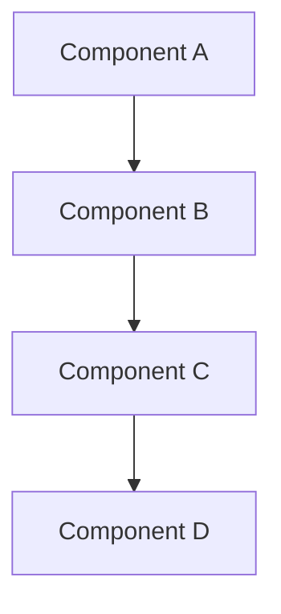

[!NOTE] Generate this report in user's own language.

# {TITLE}

- **Research Date:** {DATE}
- **Timestamp:** {TIMESTAMP}
- **Confidence Level:** {CONFIDENCE_LEVEL}
- **Subject:** {SUBJECT_DESCRIPTION}

---

## Repository Information

- **Name:** {REPOSITORY_NAME}
- **Description:** {REPOSITORY_DESCRIPTION}
- **URL:** {REPOSITORY_URL}
- **Stars:** {REPOSITORY_STARS}
- **Forks:** {REPOSITORY_FORKS}
- **Open Issues:** {REPOSITORY_OPEN_ISSUES}
- **Language(s):** {REPOSITORY_LANGUAGES}
- **License:** {REPOSITORY_LICENSE}
- **Created At:** {REPOSITORY_CREATED_AT}
- **Updated At:** {REPOSITORY_UPDATED_AT}
- **Pushed At:** {REPOSITORY_PUSHED_AT}
- **Topics:** {REPOSITORY_TOPICS}

---

## Executive Summary

{EXECUTIVE_SUMMARY}

---

## Complete Chronological Timeline

### PHASE 1: {PHASE_1_NAME}

#### {PHASE_1_PERIOD}

{PHASE_1_CONTENT}

### PHASE 2: {PHASE_2_NAME}

#### {PHASE_2_PERIOD}

{PHASE_2_CONTENT}

### PHASE 3: {PHASE_3_NAME}

#### {PHASE_3_PERIOD}

{PHASE_3_CONTENT}

---

## Key Analysis

### {ANALYSIS_SECTION_1_TITLE}

{ANALYSIS_SECTION_1_CONTENT}

### {ANALYSIS_SECTION_2_TITLE}

{ANALYSIS_SECTION_2_CONTENT}

---

## Architecture / System Overview



{ARCHITECTURE_DESCRIPTION}

---

## Metrics & Impact Analysis

### Growth Trajectory

```
{METRICS_TIMELINE}
```

### Key Metrics

| Metric | Value | Assessment |
|--------|-------|------------|
| {METRIC_1} | {VALUE_1} | {ASSESSMENT_1} |
| {METRIC_2} | {VALUE_2} | {ASSESSMENT_2} |
| {METRIC_3} | {VALUE_3} | {ASSESSMENT_3} |

---

## Comparative Analysis

### Feature Comparison

| Feature | {SUBJECT} | {COMPETITOR_1} | {COMPETITOR_2} |
|---------|-----------|----------------|----------------|
| {FEATURE_1} | {SUBJ_F1} | {COMP1_F1} | {COMP2_F1} |
| {FEATURE_2} | {SUBJ_F2} | {COMP1_F2} | {COMP2_F2} |
| {FEATURE_3} | {SUBJ_F3} | {COMP1_F3} | {COMP2_F3} |

### Market Positioning

{MARKET_POSITIONING}

---

## Strengths & Weaknesses

### Strengths

{STRENGTHS}

### Areas for Improvement

{WEAKNESSES}

---

## Key Success Factors

{SUCCESS_FACTORS}

---

## Sources

### Primary Sources

{PRIMARY_SOURCES}

### Media Coverage

{MEDIA_SOURCES}

### Academic / Technical Sources

{ACADEMIC_SOURCES}

### Community Sources

{COMMUNITY_SOURCES}

---

## Confidence Assessment

**High Confidence (90%+) Claims:**
{HIGH_CONFIDENCE_CLAIMS}

**Medium Confidence (70-89%) Claims:**
{MEDIUM_CONFIDENCE_CLAIMS}

**Lower Confidence (50-69%) Claims:**
{LOW_CONFIDENCE_CLAIMS}

---

## Research Methodology

This report was compiled using:

1. **Multi-source web search** - Broad discovery and targeted queries
2. **GitHub repository analysis** - Commits, issues, PRs, activity metrics
3. **Content extraction** - Official docs, technical articles, media coverage
4. **Cross-referencing** - Verification across independent sources
5. **Chronological reconstruction** - Timeline from timestamped data
6. **Confidence scoring** - Claims weighted by source reliability

**Research Depth:** {RESEARCH_DEPTH}
**Time Scope:** {TIME_SCOPE}
**Geographic Scope:** {GEOGRAPHIC_SCOPE}

---

**Report Prepared By:** Github Deep Research by DeerFlow
**Date:** {REPORT_DATE}
**Report Version:** 1.0
**Status:** Complete
